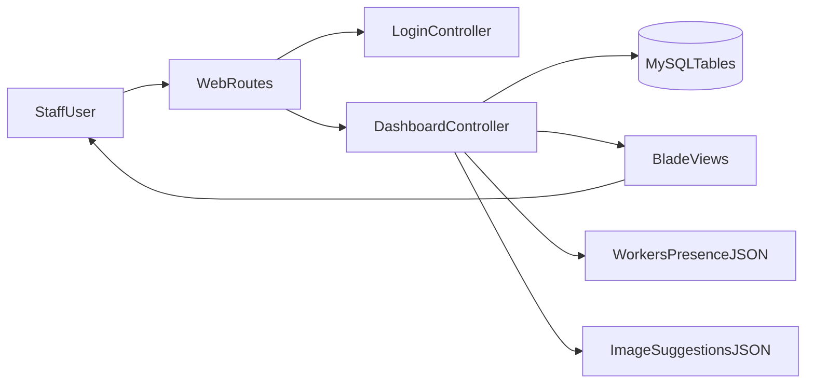

# Full Project Knowledge Audit

This document is the living system map for the `shishaSite` project. It is designed so future feature requests can be implemented quickly without losing context.

## 1) Architecture and Data Model Truth Map

### Stack and Runtime
- Framework: Laravel 12 + PHP 8.2 (`composer.json`)
- UI rendering: server-side Blade templates (`resources/views`)
- Frontend tooling: Vite/Tailwind present, but core UX is Blade + page-level JS (`package.json`, `resources/js/app.js`, `public/css/style.css`)
- Primary business logic hub: `app/Http/Controllers/DashboardController.php`

### Route-to-Handler Canonical Map

#### Auth and entry
- `GET /` -> closure redirect gate (`routes/web.php`)
- `GET /login` -> `LoginController@show` -> `resources/views/auth/login.blade.php`
- `POST /login` -> `LoginController@authenticate`
- `POST /logout` -> `LoginController@logout`

#### Main pages
- `GET /dashboard` -> `DashboardController@index` -> `resources/views/dashboard.blade.php`
- `GET /tables` -> `DashboardController@tables` -> `resources/views/tables.blade.php`
- `GET /products` -> `DashboardController@products` -> `resources/views/products.blade.php`
- `GET /reports` -> `DashboardController@reports` -> `resources/views/reports.blade.php`

#### Operational APIs/actions
- `GET /dashboard/workers-presence` -> `DashboardController@workersPresence` (JSON)
- `POST /dashboard/brands` -> `DashboardController@addBrand`
- `POST /dashboard/products` -> `DashboardController@addProduct`
- `PUT /dashboard/products/{productId}` -> `DashboardController@updateProduct`
- `DELETE /dashboard/products/{productId}` -> `DashboardController@deleteProduct`
- `GET /dashboard/products/image-suggestions` -> `DashboardController@imageSuggestions` (JSON)
- `POST /dashboard/hookah-recipes` -> `DashboardController@addHookahRecipe`
- `POST /dashboard/tables/layout` -> `DashboardController@setTableCount`
- `POST /dashboard/tables/{tableId}/toggle` -> `DashboardController@toggleTable`
- `POST /dashboard/tables/{tableId}/status` -> `DashboardController@setTableStatus`
- `POST /dashboard/tables/{tableId}/reservations` -> `DashboardController@createReservation`
- `POST /dashboard/orders/items` -> `DashboardController@addOrderItem`
- `POST /dashboard/orders/ai` -> `DashboardController@aiAddOrder`
- `POST /dashboard/orders/close` -> `DashboardController@closeOrder`

### Canonical Domain Entities
- `brands`: unique `name`, plus category (`database/migrations/2026_04_26_120000_add_category_to_brands_table.php`)
- `products`: belongs to brand, unique `(brand_id, name)`, stock/price/unit/activity/image fields
- `store_tables`: unique table number, activity + status
- `orders`: belongs to table (+optional user), status `open|paid`, totals and open/close timestamps
- `order_items`: belongs to order/product, quantity/unit price/line total/meta note
- `table_reservations`: reservation windows per table
- `hookah_recipes`: hookah product to tobacco product mapping with grams per serving
- `users`: auth user with unique `username` and `last_seen_at` presence field

### Effective Data Invariants (from runtime behavior)
- `orders.total_amount` is recomputed as sum of `order_items.line_total` after append.
- Adding an item decrements product stock immediately.
- Hookah items additionally consume tobacco stock via `hookah_recipes`.
- Closing an order restores hookah device stock but does not restore tobacco grams.
- Reservation overlap is blocked in application logic for active reservations on same table/time.
- Table UI status is derived from a mix of static status and live signals (open order/reservation existence).

### Known Schema-vs-Logic Mismatches
- `setTableStatus()` accepts only `available|occupied|inactive`, but reservation flow writes `reserved`.
- `store_tables.reserved_from/reserved_to/reserved_people` exist but reservation truth is in `table_reservations`.
- No DB-level guard for single open order per table.
- No DB-level enum/check for categories/reservation statuses.

## 2) End-to-End Flow Decomposition

### A) Login and Presence
1. `GET /` redirects to login or dashboard by auth state.
2. `POST /login` validates username/password and calls `Auth::attempt`.
3. On success, session regenerates and `users.last_seen_at` is updated.
4. Dashboard pages repeatedly refresh online worker status via `/dashboard/workers-presence`.
5. `POST /logout` clears session/auth and nulls `last_seen_at`.

### B) Table Selection and Table Status
1. `GET /dashboard` or `GET /tables` builds page data with selected table (`?table=...`).
2. Controller computes open-order and active-reservation aggregates per table.
3. UI highlights table state as occupied/reserved/available/inactive.
4. Manual status endpoint updates `store_tables.status` (blocked when open order exists).
5. Reservation creation inserts into `table_reservations` and sets table status `reserved`.

### C) AI Order Add Flow
1. User submits free text to `POST /dashboard/orders/ai`.
2. Controller validates text + table id, stores prompt draft in session.
3. Text parser splits quantities/tokens and applies normalization/synonyms.
4. Matcher resolves products (plus hookah flavor/type handling).
5. Transaction locks products, validates stock/activity, appends items.
6. Order totals are recalculated; stock is decremented; feedback returned by flash messages.

### D) Product CRUD and Image Suggestions
1. Products page applies query/category/sort filters and paginates.
2. Create/update validates category rules (hookah name normalization, tobacco price/unit normalization).
3. Duplicate prevention combines DB uniqueness with case-insensitive app checks.
4. Image suggestion endpoint returns probable images from DB paths + filesystem scan.
5. Delete removes product but may hit FK restrictions if referenced by `order_items`.

### E) Order Closing and Reports
1. Closing bill finds open order for a table and runs transaction.
2. Hookah item quantities are summed; hookah stock is restored.
3. Order is marked `paid` with `closed_at`.
4. Reports load paid-order summaries by date/table/detail; stored procedure path for MySQL with fallback query.

## 3) Prioritized Runtime Risk Audit

### Critical
- Missing role/permission boundaries; all authenticated users can execute sensitive mutations.
- Race condition risk on concurrent order close can inflate hookah stock.

### High
- No login throttling visible around auth endpoint.
- Concurrent first-item add can create multiple open orders for one table.
- Reservation can be created for table with active service/open order.

### Medium-High
- Deleting a product referenced by historical `order_items` can cause server error instead of graceful handling.

### Medium
- Image suggestion endpoint can become expensive due to full directory scan per query.
- Status model inconsistency (`reserved` state handling split across logic paths).

## 4) Test Strategy and Confidence Ladder

### Priority Backlog (first wave)
- Auth:
  - guest redirects from protected pages
  - successful login updates `last_seen_at`
  - failed login path
  - logout clears session and presence
- Orders/stock:
  - add item creates/uses open order and decrements stock
  - insufficient stock has no partial writes
  - close order sets paid/closed and restores hookah stock only
- Tables/reservations:
  - status change blocked when table has open order
  - overlap reservations rejected
  - reservation marks table reserved
- Products:
  - category normalization (hookah/tobacco rules)
  - duplicate name prevention (case-insensitive same brand)
  - image suggestion behavior for short vs valid queries
- Reporting/presence/parser:
  - report date normalization + range swap behavior
  - workers presence threshold behavior
  - parser unit coverage for quantity/token split
  - hookah flavor resolution with near-match and unknown tokens

### Confidence Ladder
1. **Milestone A (Auth green):** safe to refactor login/session routing/UI copy.
2. **Milestone B (Order integrity green):** safe to evolve order and stock paths.
3. **Milestone C (Catalog/reservations green):** safe to modify products + reservation UX logic.
4. **Milestone D (Reports/presence green):** safe to optimize reporting/presence query paths.
5. **Milestone E (AI parser green):** safe to iterate parser grammar and matching heuristics.

## 5) Living Handbook: Safe-Change Playbook

### File Ownership Map
- **Auth/session:** `app/Http/Controllers/Auth/LoginController.php`, `resources/views/auth/login.blade.php`
- **Business core:** `app/Http/Controllers/DashboardController.php`
- **Routing contract:** `routes/web.php`
- **UI surfaces:** `resources/views/dashboard.blade.php`, `tables.blade.php`, `products.blade.php`, `reports.blade.php`
- **Domain schema:** `database/migrations/*.php`
- **Tests:** `tests/Feature`, `tests/Unit`

### Rules to Avoid Regressions
- Treat `appendOrderItem`, `consumeHookahTobacco`, and `closeOrder` as high-risk transactional hot spots.
- Any change to table state must be checked against open-order and reservation read models.
- Product deletion/stock logic must preserve historical order integrity.
- Keep report filters and date normalization deterministic (same input -> same output).

### Recommended Refactor Roadmap (incremental)
1. Add tests for highest-risk flows before structural refactor.
2. Extract order/stock logic from `DashboardController` into dedicated service class(es).
3. Introduce explicit authorization policies/roles for sensitive endpoints.
4. Add DB-level protections for critical invariants (single open order per table, stricter status/category constraints where appropriate).
5. Optimize expensive query/filesystem paths once correctness is protected by tests.

### Maintenance Process
- Update this handbook whenever:
  - routes/controller signatures change
  - schema migrations alter business invariants
  - new operational flows are introduced
  - new risks are found or mitigated
- Keep a one-line changelog section here with date + what changed in system behavior.

## System Flow Diagram

